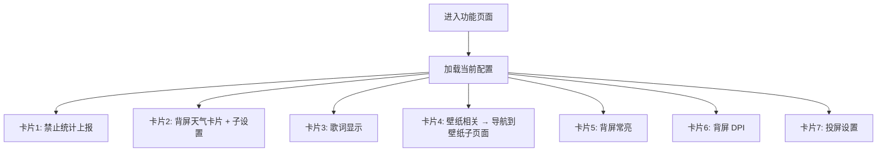
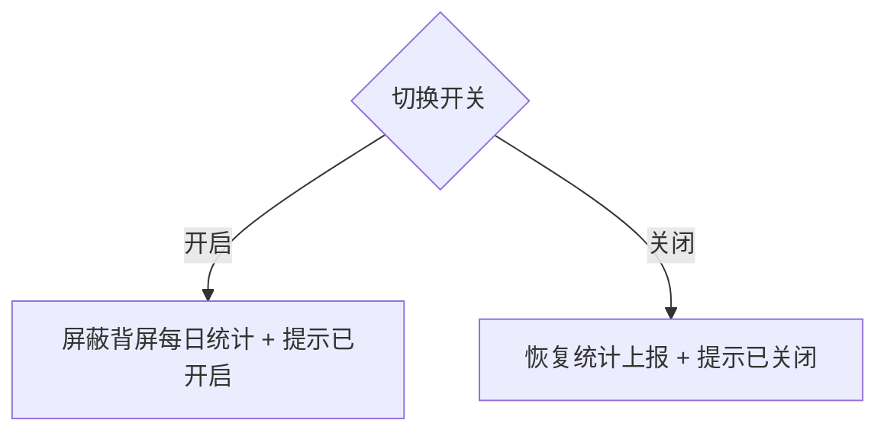
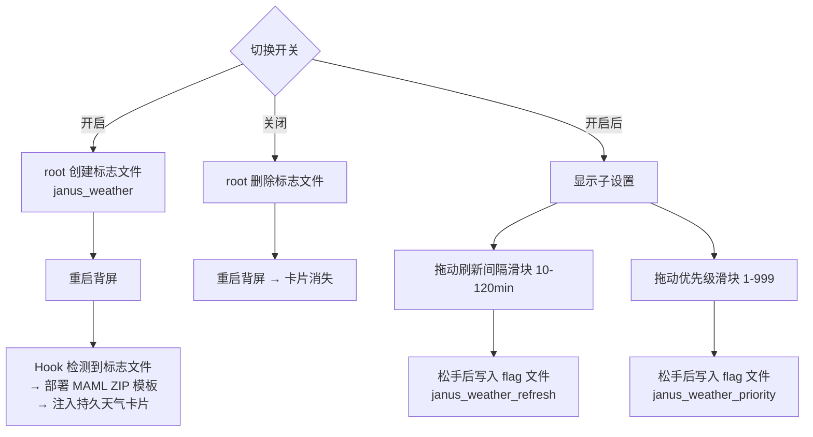
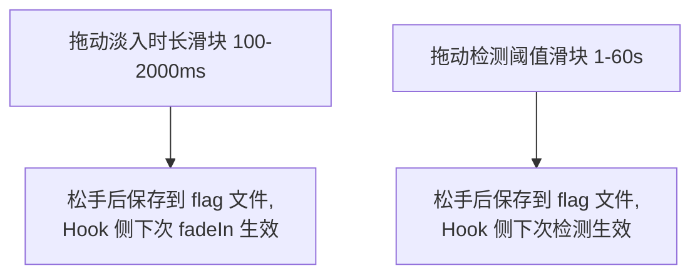
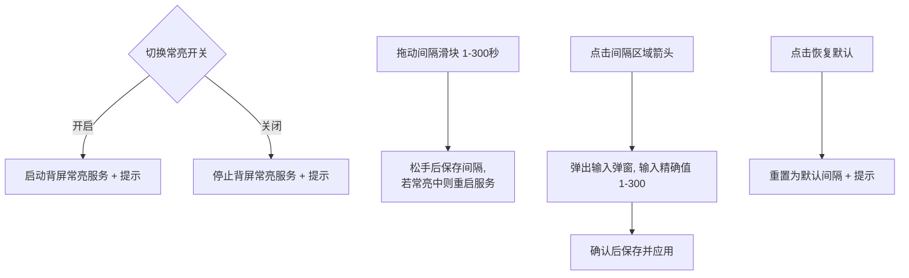
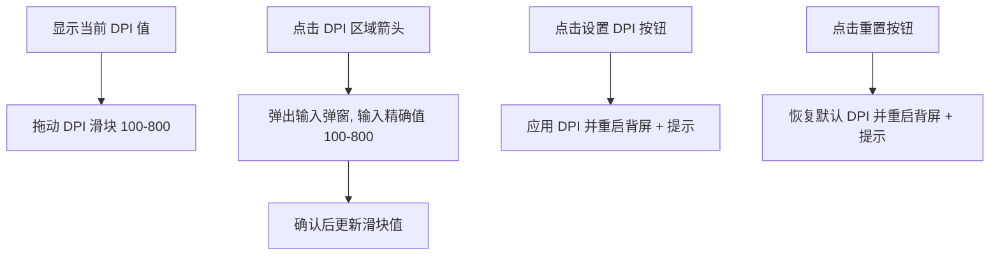
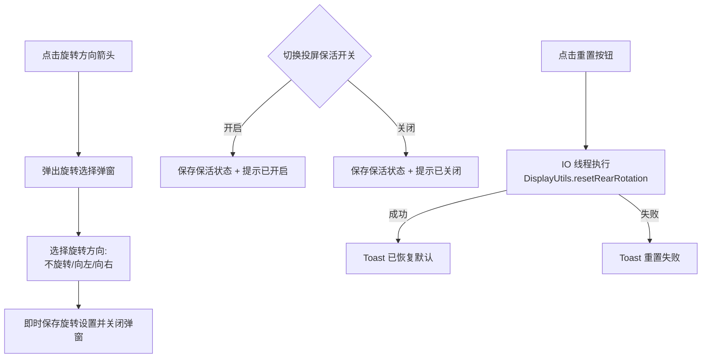
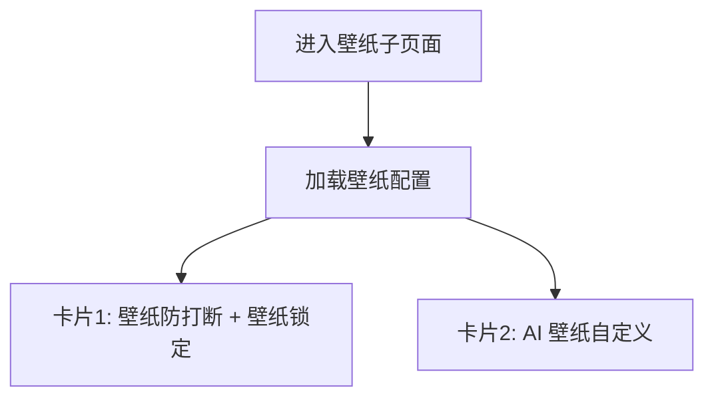
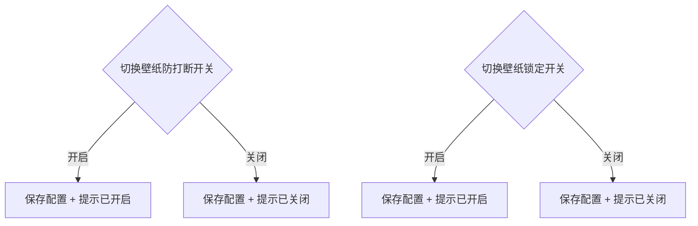
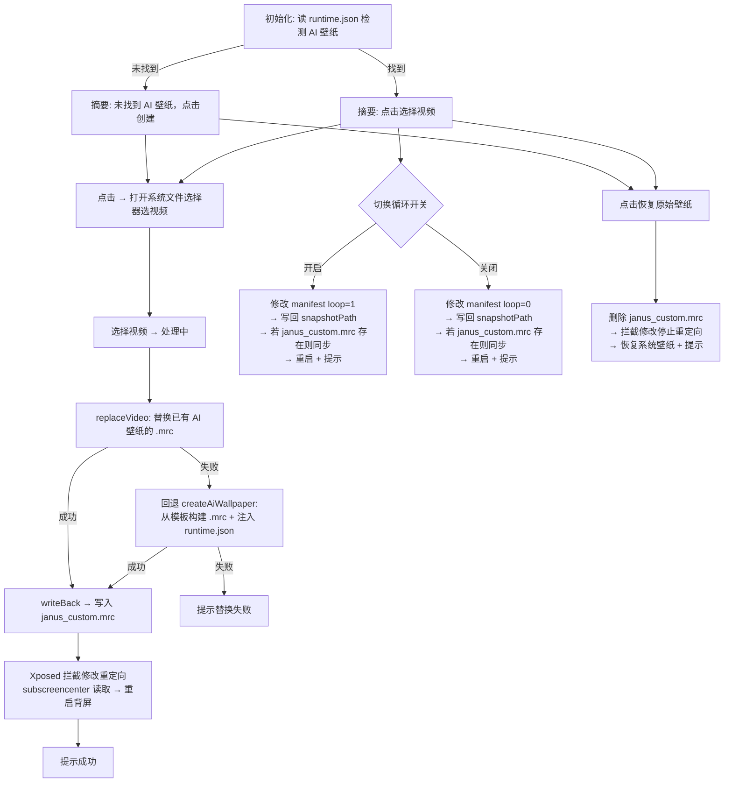

# 功能 (FeaturesPage) 页面流程

## 页面概述

功能页面用于配置背屏高级功能（Tab 2（第三个标签页））。功能按顺序排列为八个卡片区域：禁止统计上报、背屏天气卡片（含刷新间隔和优先级子设置）、歌词显示（淡入时长和检测阈值）、壁纸相关（导航入口，点击进入壁纸子页面）、背屏常亮（含间隔滑块+弹窗+重置）、背屏DPI（含滑块+弹窗+设置/重置）、投屏设置（旋转方向选择弹窗 + 保活开关 + 重置旋转按钮）。所有设置通过 SharedPreferences（应用本地配置文件）即时保存，开关操作有 Toast（底部短暂弹出的提示）反馈。

**源文件**: `app/src/main/kotlin/org/pysh/janus/ui/FeaturesPage.kt`

## 页面流程

### 总览

### 卡片1: 禁止统计上报

### 卡片2: 背屏天气卡片

- **子设置**: 天气卡片开启后显示两个额外的 Slider 设置项
  - **刷新间隔**（10-120 分钟，默认 30 分钟）：控制天气数据刷新频率，通过 flag 文件 `janus_weather_refresh` 传递给 WeatherCardHook。需重启背屏生效
  - **卡片优先级**（1-999，默认 100）：控制天气卡片在服务助手面板中的排序位置，数值越大越靠前。通过 flag 文件 `janus_weather_priority` 传递给 WeatherCardHook。需重启背屏生效
- **开关机制**: 由于 XSharedPreferences 在 KernelSU + SELinux Enforcing 下不可用，使用文件标志位实现跨进程通信。Janus app 通过 root 在 `/data/system/theme_magic/users/0/subscreencenter/config/janus_weather` 创建/删除标志文件（创建时附带 `chcon u:object_r:theme_data_file:s0` 确保 subscreencenter 可读），Hook 端检查文件是否存在
- **开关后自动重启背屏**: `setWeatherCardEnabled()` 在 IO 线程执行 root 操作并调用 `RootUtils.restartBackScreen()`
- 需要 Xposed Hook 生效：Hook subscreencenter 的 SmartAssistantManager，注册 weather 业务类型，部署 MAML ZIP 模板，通过通知管线注入持久卡片
- 天气数据由 MAML 模板内的 `ContentProviderBinder` 直接查询 `content://weather/actualWeatherData/curPosition` 和 `content://weather/hourlyData/curPosition`
- 显示内容：城市、温度、天气描述、高低温、AQI、逐时预报、风力、湿度

### 卡片3: 歌词显示

- **淡入时长**: 歌词切换时淡入动画持续毫秒数（100-2000ms，默认 700ms），通过 flag 文件 `janus_lyric_fade` 传递给 MusicTemplatePatch Hook
- **检测阈值**: 标题在此时间内变化则识别为歌词模式（1-60秒，默认 15秒），通过 flag 文件 `janus_lyric_threshold` 传递给 MusicTemplatePatch Hook
- UI 层以秒为单位显示和编辑，存储和传递时转换为毫秒
- 两个设置均无需重启背屏，Hook 侧每次事件触发时实时读取 flag 文件

### 卡片4: 壁纸相关（导航入口）

- 点击 `SuperArrow`（带箭头的可点击项） → 导航到 `WallpaperPage` 壁纸子页面

### 卡片5: 背屏常亮

### 卡片6: 背屏 DPI

### 卡片7: 投屏设置

## 功能区域详情

### 1. 禁止统计上报
- 开关控件，切换时即时保存到 SharedPreferences
- Toast 反馈开启/关闭状态

### 2. 背屏天气卡片
- 开关控件，切换时即时保存到 SharedPreferences
- Toast 反馈开启/关闭状态
- **子设置（开启后可见）**: 刷新间隔（10-120 分钟）和卡片优先级（1-999），通过 `syncContentFlag` 写入 flag 文件，Hook 侧通过 `MamlConstants.readIntFlag()` 读取
- **MAML 模板国际化**: 模板中的中文字符串（空气质量、湿度、加载提示等）根据 `Locale.getDefault()` 在部署时动态生成中/英文版本
- **Xposed Hook 机制**: 在 subscreencenter 的 SmartAssistantManager 中注册 `weather` 业务类型，部署原创 MAML ZIP 模板到 `smart_assistant/weather`，通过通知管线（`RunnableC0082m`）注入持久卡片。标记为 protected（同隐身助手），卡片常驻不消失
- **天气数据**: MAML 模板通过 `ContentProviderBinder` 直接查询 MIUI 天气 ContentProvider，无需 Hook 注入变量
- **开关持久化**: 通过文件标志位（`/data/system/theme_magic/.../janus_weather`）跨进程通信，绕过 XSharedPreferences 的 SELinux 限制。创建标志文件时执行 `chcon u:object_r:theme_data_file:s0` 确保 SELinux 上下文正确

### 3. 歌词显示
- **淡入时长**（100-2000ms，默认 700ms）：控制歌词切换时的淡入动画持续时间，通过 flag 文件 `janus_lyric_fade` 传递给 MusicTemplatePatch 的 `fadeIn()` 方法
- **检测阈值**（1-60 秒，默认 15 秒）：标题在此时间内变化则识别为歌词模式并启用跑马灯滚动，通过 flag 文件 `janus_lyric_threshold` 传递给 MusicTemplatePatch 的 `hookMetadataUpdate()`
- **数据流**: UI 设置 → `WhitelistManager` SharedPreferences → `syncContentFlag` 写 flag 文件 → Hook 通过 `MamlConstants.readIntFlag()` 每次事件时实时读取，无需重启

### 4. 壁纸相关（导航入口）
- `SuperArrow` 导航项，点击进入壁纸子页面（`WallpaperPage`）
- 壁纸相关功能详见下方"壁纸子页面"章节

### 5. 背屏常亮
- **常亮开关**: 开启启动 ScreenKeepAliveService（背屏常亮服务），关闭停止服务
- **唤醒间隔**: Slider（滑动条）滑块（1-300秒），松手后保存；点击箭头弹出 SuperDialog（弹窗组件）输入精确值
- **恢复默认按钮**: 重置为 ScreenKeepAliveService.DEFAULT_INTERVAL

### 6. 背屏 DPI
- **DPI 显示**: 当前 DPI 值（加载中显示"加载中"）
- **DPI 滑块**: 范围 100-800，拖动调整
- **输入弹窗**: 点击箭头弹出 SuperDialog，输入精确 DPI 值（100-800），确认后更新滑块
- **设置按钮**: 调用 DisplayUtils（显示相关工具）.setRearDpi 并通过 RootUtils（Root 权限工具）.restartBackScreen 重启背屏
- **重置按钮**: 调用 DisplayUtils.resetRearDpi 恢复默认并重启背屏

### 7. 投屏设置
- **旋转方向**: 点击弹出 SuperDialog，通过 SuperRadioButton（单选按钮）选择旋转方向（0=不旋转, 1=向左, 3=向右），选择后即时保存并关闭弹窗
- **投屏保活**: 开关控件，切换时即时保存，Toast 反馈
- **重置旋转**: 点击"重置"按钮，在 IO 线程调用 `DisplayUtils.resetRearRotation()` 清除残留的背屏旋转状态（`wm user-rotation free` + `wm fixed-to-user-rotation default`），即时生效无需重启背屏，Toast 反馈成功/失败。用于进程被杀后旋转状态未自动还原的场景

---

## 壁纸子页面 (WallpaperPage) 流程

### 页面概述

壁纸子页面用于管理背屏壁纸相关功能，从功能页面的"壁纸相关"入口导航进入。包含动态壁纸防打断、壁纸锁定、AI 壁纸自定义（视频替换+循环+恢复）三组功能。

**源文件**: `app/src/main/kotlin/org/pysh/janus/ui/WallpaperPage.kt`

### 总览

### 卡片1: 动态壁纸防打断 + 壁纸锁定

### 卡片2: AI 壁纸自定义

### 功能详情

#### 1. 动态壁纸防打断 + 壁纸锁定
- **壁纸防打断**: 开关控件，切换时通过 `WhitelistManager`（白名单管理工具）`.setWallpaperKeepAlive()` 即时保存
  - Toast 反馈开启/关闭状态
  - **Xposed Hook（通过 Xposed 框架拦截并修改目标应用的行为）机制**: Hook（拦截修改） `SubScreenLauncher.onPause()`，开启时跳过 `MainPanel.A()` 调用，阻止背屏遮盖时 MAML（小米自研的动态壁纸渲染引擎）壁纸引擎被销毁。通过反射设置 `Activity.mCalled = true` 并调用 `dispatchActivityPaused()` 满足生命周期检查
- **壁纸锁定**: 开关控件，切换时通过 `WhitelistManager.setWallpaperLocked()` 即时保存
  - Toast 反馈开启/关闭状态
  - **Xposed Hook 机制**: Hook `Z1.t.e(MotionEvent)`（MainPanel 壁纸轮播的长按手势处理器），开启时返回 false 阻止手势识别，使用户无法长按进入壁纸编辑模式，从而防止误触切换壁纸

#### 2. AI 壁纸自定义
- **前置条件**: Root 权限（不再要求预设 AI 壁纸）
- **壁纸探测**: 进入页面时读取 `runtime.json`（系统壁纸配置文件），查找 `resSubType == "ai"` 的条目
- **独立创建**: 无 AI 壁纸时，用户选择视频后自动从内置模板（`assets/wallpaper_template/`）构建 .mrc（小米壁纸的打包格式）壁纸包，克隆 signature 条目注入 runtime.json
- **替换壁纸视频**: 先尝试 `replaceVideo`（替换已有 AI 壁纸的 .mrc），失败则自动回退到 `createAiWallpaper`（重新创建）
- **Xposed Hook 路径重定向**: subscreencenter 的 `widget.json`（subscreencenter 实际读取的壁纸配置）指向只读分区的 .mrc，Hook `m2.a.d()` 方法将读取重定向到 Janus 专用路径 `janus_custom.mrc`（可写）。仅当 `janus_custom.mrc` 存在时重定向，不影响系统壁纸
- **模板 .mrc**: manifest.xml 中视频 `visibility="1"`（始终显示），`isDisplayDefaultBg` 默认为 0（防止 resume 时释放视频），不依赖 editConfig 的 bgmode 设置
- **视频循环播放**: 切换开关 → 修改 manifest.xml 中最后一个 `loop` 属性 → 写回 snapshotPath → 若 `janus_custom.mrc` 已存在则同步更新（不会主动创建）→ 重启背屏
- **恢复原始壁纸**: 删除 `janus_custom.mrc` → Hook 停止重定向 → subscreencenter 加载系统原始壁纸
- **数据层**: 循环偏好通过 `WhitelistManager.setWallpaperLoop()` 持久化
