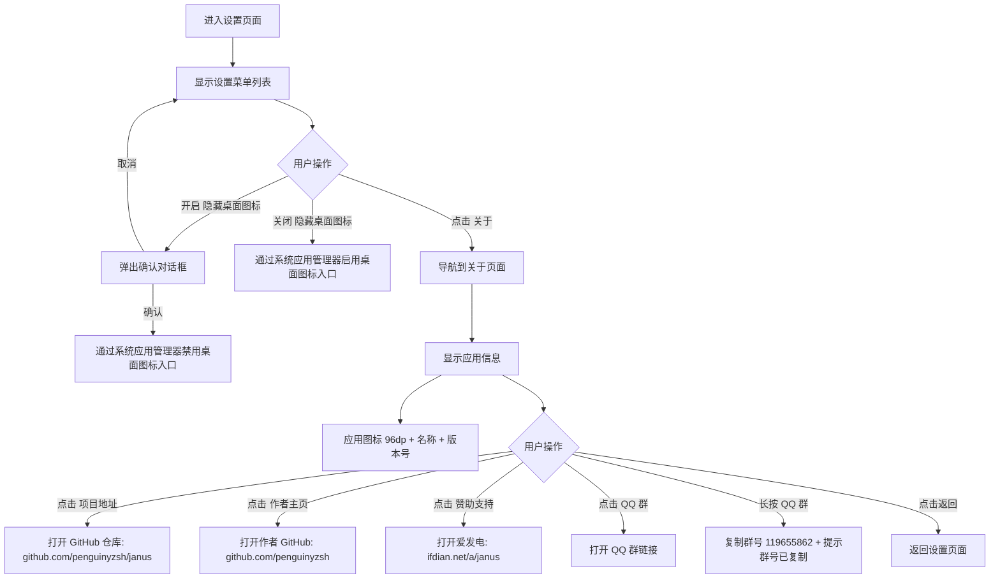

# 设置 (SettingsPage) 页面流程

## 页面概述

设置页面提供应用级配置入口（Tab 3（第四个标签页）），包含隐藏桌面图标开关和"关于"页面导航。关于页面显示应用图标、名称、版本号（读取 BuildConfig.VERSION_NAME（应用的版本号文字，如 "1.0.5"）），以及项目地址、作者主页、赞助支持链接。

**源文件**: `app/src/main/kotlin/org/pysh/janus/ui/SettingsPage.kt`
**关联文件**: `app/src/main/kotlin/org/pysh/janus/ui/AboutPage.kt`

## 页面流程

## 关于页面详情

- **应用图标**: 动态读取当前应用图标，96dp（与屏幕密度无关的尺寸单位）显示
- **应用名称**: 读取 R.string.app_name（应用名称的字符串资源）
- **版本号**: 显示 `v${BuildConfig.VERSION_NAME}`
- **项目地址**: SuperArrow（带箭头的可点击项），右侧显示 "GitHub"，点击打开 `https://github.com/penguinyzsh/janus`
- **作者主页**: SuperArrow，右侧显示 "YunPeng"，点击打开 `https://github.com/penguinyzsh`
- **赞助支持**: SuperArrow，右侧显示 "爱发电"，点击打开 `https://ifdian.net/a/janus`
- **QQ 群**: SuperArrow（`Box` + `combinedClickable` 包裹），右侧显示 "119655862"，点击打开 `https://qm.qq.com/q/UJBp9bNnIQ`，长按复制群号到剪贴板
