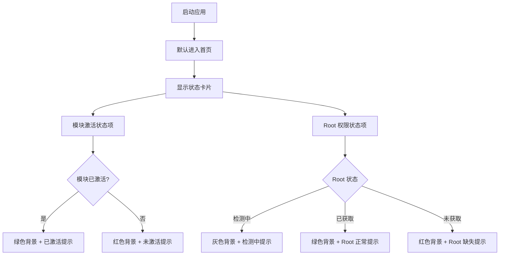

# 首页 (HomePage) 页面流程

## 页面概述

首页是应用的默认页面（Tab 0（第一个标签页）），启动后默认展示。页面显示 StatusCard（状态卡片组件），包含模块激活状态和 Root 权限状态两个状态项。页面无用户交互操作，仅作为状态展示。

**源文件**: `app/src/main/kotlin/org/pysh/janus/ui/HomePage.kt`
**关联文件**: `app/src/main/kotlin/org/pysh/janus/ui/StatusCard.kt`

## 页面流程

## 状态说明

| 项目 | 状态 | 显示 |
|------|------|------|
| 模块 | 已激活 | 绿色背景：模块已激活 |
| 模块 | 未激活 | 红色背景：模块未激活，提示前往 LSPosed 启用 |
| Root | 检测中 | 灰色背景：正在检测 |
| Root | 已获取 | 绿色背景：Root 权限正常 |
| Root | 未获取 | 红色背景：无 Root 权限，提示授予 |

## 更新通告弹窗

首页承载版本更新通告弹窗，由 `MainScreen` 控制状态。

- **版本检测**: `MainScreen` 在初始化时比较 `WhitelistManager.getLastSeenVersion()` 与 `BuildConfig.VERSION_CODE`（应用的版本号数字，每次发版递增），若有新版本则 `showUpdateDialog = true`（Debug 构建始终为 true）
- **弹窗展示**: `HomePage` 接收 `showUpdateDialog` 和 `onDismissUpdateDialog` 参数，在 Scaffold 同级放置 `SuperDialog`（弹窗组件）
- **用户操作**: 点击"知道了"或弹窗外部 → 调用 `onDismissUpdateDialog` → `MainScreen` 中设置 `showUpdateDialog = false` 并通过 `WhitelistManager.setLastSeenVersion()` 持久化当前版本号
- **QQ 群入口**: 弹窗内 `SuperArrow`（带箭头的可点击项）卡片，点击跳转 `https://qm.qq.com/q/UJBp9bNnIQ`
- **爱发电入口**: 弹窗内 `SuperArrow` 卡片，标题"爱发电支持"，右侧显示链接 `ifdian.net/a/janus`，点击打开 `https://ifdian.net/a/janus`
